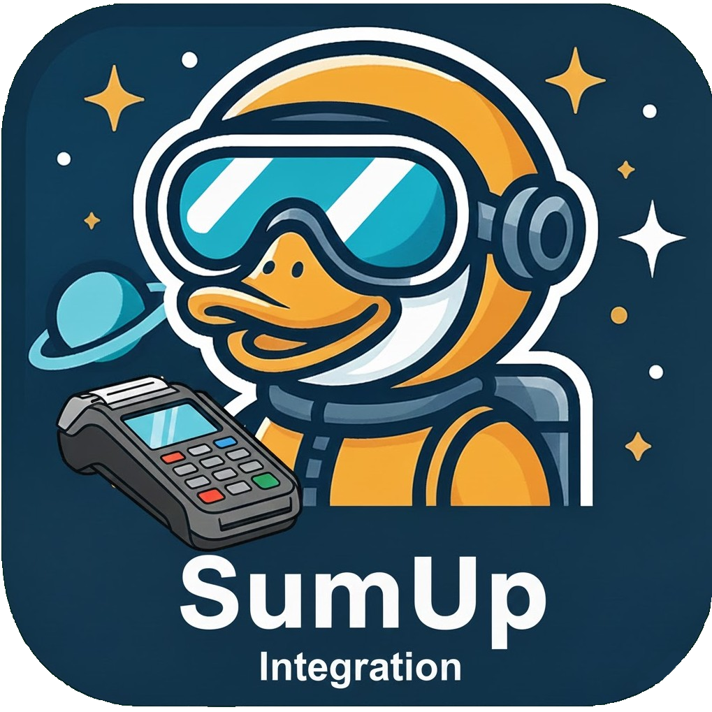

<div align="center">
  <p>
    
  </p>
    <h1>SumUp ERPNext Integration <br> (WORK IN PROGRESS)</h1>
</div>

Diese App integriert SumUp-Kartenterminals in ERPNext und ermöglicht die direkte Verarbeitung von Kartenzahlungen innerhalb des Systems.

Bei Auswahl von Kartenzahlungen wird der zu zahlende Betrag automatisch an ein SumUp-Terminal übertragen. Nach erfolgreicher Zahlung wird das Zahlungsergebnis an ERPNext zurückgemeldet

> **Markenhinweis:**
> SumUp ist eine eingetragene Marke der SumUp Payments Limited.
> Dieses Projekt steht in keiner Verbindung zu SumUp.

## Supported Versions

| ERPNext | Frappe | Support-Status |
|---------|--------|----------------|
| v16 Beta    | v16 Beta   | ⚙️ Bald Verfügbar     |
| v15     | v15    | ⚙️ Bald Verfügbar     |

## Installation (Frappe Cloud)

Die App kann direkt über die Frappe Cloud installiert werden:

1. Öffne das Frappe Cloud Dashboard unter <https://frappecloud.com/dashboard/#/sites>
2. Klicke auf **"New Site"**, um eine neue Instanz zu erstellen
3. Im Schritt **„Select apps to install“**:
   - Wähle die gewünschte Frappe-/ERPNext-Version aus  
   - Aktiviere zusätzlich die App **`ERPNEXT SumUp`**
4. Schließlich den Assistenten abschließen bis die Seite erstellt wurde

## Installation (Self-Hosted)

Sobald ERPNext installiert ist wird die App mittels des folgenden Befehl zur Bench Umgebung hinzugefügt.

```bash
bench get-app https://github.com/Rocket-Quack/erpnext_sumup.git --branch version-15
```

Anschließend kann die App für eine Seite installiert werden.
```bash
bench --site yoursite.com install-app erpnext_sumup
```

## Markenhinweis

**SumUp** ist eine eingetragene Marke der **SumUp Payments Limited**.

Dieses Projekt ist eine **unabhängige und inoffizielle Integration** und steht **in keiner Verbindung zu SumUp**.
Es wird **weder von SumUp betrieben, unterstützt noch empfohlen**.

Die Nennung von SumUp erfolgt ausschließlich zur **Beschreibung der technischen Kompatibilität bzw. Integration** mit den entsprechenden Diensten.

## License

Copyright (C) 2025 RocketQuackIT

This program is free software: you can redistribute it and/or modify it under the terms of the GNU General Public License as published by the Free Software Foundation, either version 3 of the License, or (at your option) any later version.

This program is distributed in the hope that it will be useful, but WITHOUT ANY WARRANTY; without even the implied warranty of MERCHANTABILITY or FITNESS FOR A PARTICULAR PURPOSE. See the GNU General Public License for more details.

GNU GPL V3. See the LICENSE file for more information.